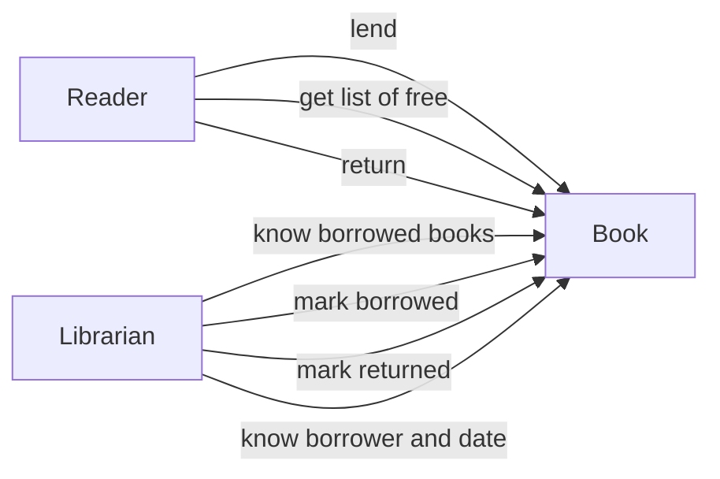
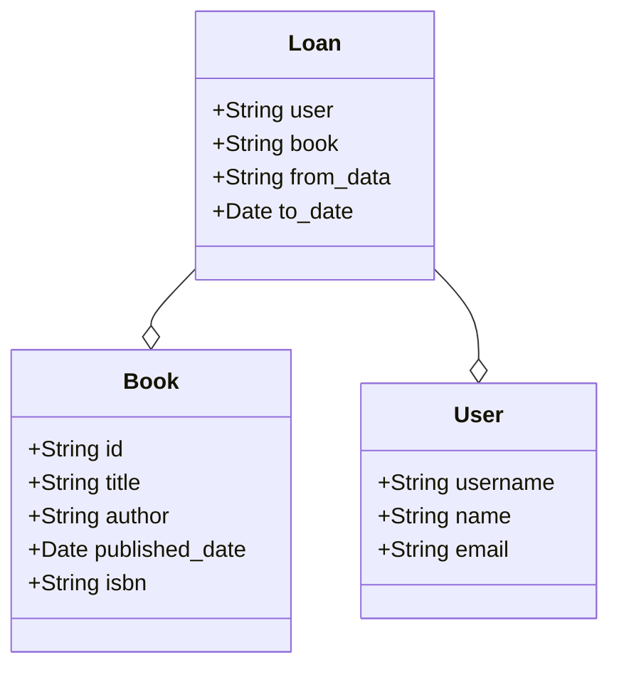

# Book Lending System - task assignment
_Our library needs a simple system to manage book borrowing._
The goal is to create a solution that will make it easier to monitor the availability of books and keep track of borrowings.

## Main requirements:
1. We want to keep track of all the books in our library.
We need to store information about the title of the book, its author and whether it is available  for borrowing.
2. The system must be able to record who borrowed a book and when.
When a book is returned, we want to be able to mark it as available.
The ID of the user who borrowed/returned the book will be sent in the x-user-id header.
The user ID will not be included in the request body.
3. Availability of books
The system should automatically keep track of which books are available and which are currently
checked out.
We need to be able to easily find out which books are currently available.

## Output requirements:
Build the application as a REST API


# Analysis

# Use cases
- Reader wants to lend a book.
- Reader wants get a list of free books.
- Reader wants to return a book (mostly).

- Librarian wants to know which books are borrowed.
- Librarian wants to mark book as borrowed.
- Librarian wants to mark book as returned.
- Librarian wants to know who borrowed the book and when




We will need these entities
- User
- Book
- Loan




# Solution
## Technology
- Python + Django
- Postgress

# How to run
```sh
docker compose build
docker compose up
docker compose exec web python manage.py migrate
docker-compose exec web python manage.py  loaddata fixtures/books.json
docker-compose exec web python manage.py  loaddata fixtures/users.json
docker-compose exec web python manage.py  loaddata fixtures/loans.json

```

# How to run tests
```sh
 docker-compose exec web python  manage.py test  
 ```


# API description
# History of all loans

 ```GET /api/loans/```

## How to borrow a book 

call ```POST /api/loans/``` with data 
```json
{
   "user": 1,
    "book": 4,
    "from_date": "2024-07-11",
    "to_date": "2024-08-11"
}
```

## How to return a book

call ```GET api/loans/1/return_book/``` where 1 is loan id.

## Get borrowed books

call ```GET http://localhost:8000/api/books/borrowed/```


## Get unborowed books

call ```GET http://localhost:8000/api/books/free/```


Everything else is standart behavior as could be except Loans, because from logical reasons it is not allowed to edit Loans.

## Get user who lend the book
call ```GET api/books/1/``` It returns data and user Id in header **x-user-id**.