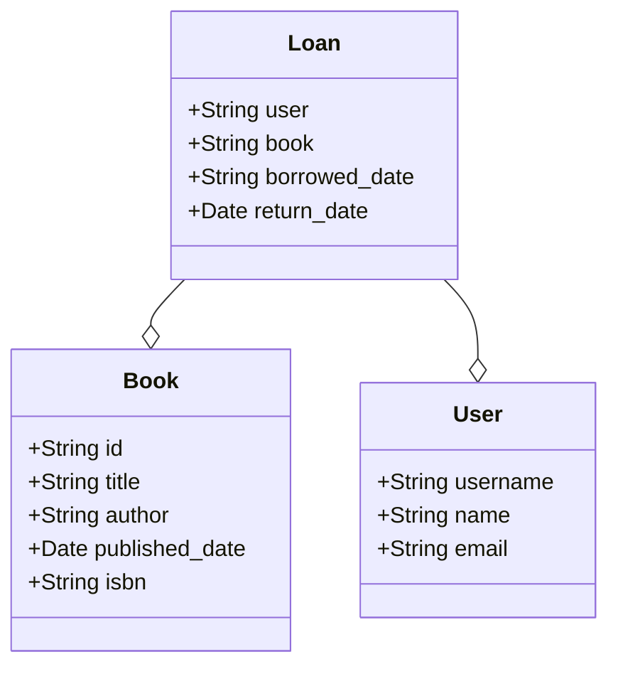

# Book Lending System - task assignment
_Our library needs a simple system to manage book borrowing._
The goal is to create a solution that will make it easier to monitor the availability of books and keep track of borrowings.

## Main requirements:
1. We want to keep track of all the books in our library.
We need to store information about the title of the book, its author and whether it is available for available for borrowing.
2. The system must be able to record who borrowed a book and when.
When a book is returned, we want to be able to mark it as available.
The ID of the user who borrowed/returned the book will be sent in the x-user-id header.
The user ID will not be included in the request body.
3. Availability of books
The system should automatically keep track of which books are available and which are currently
checked out.
We need to be able to easily find out which books are currently available.

## Output requirements:
Build the application as a REST API

# Analysis

